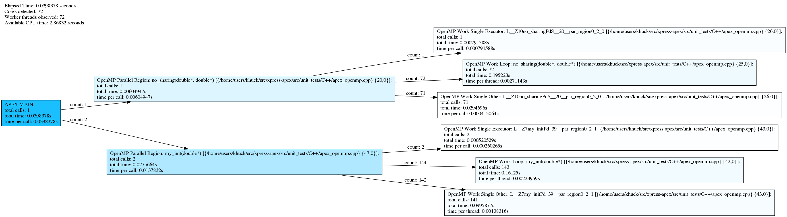
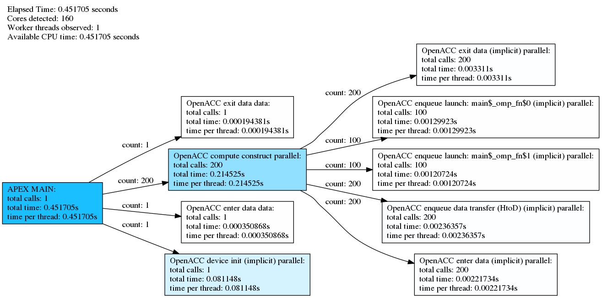
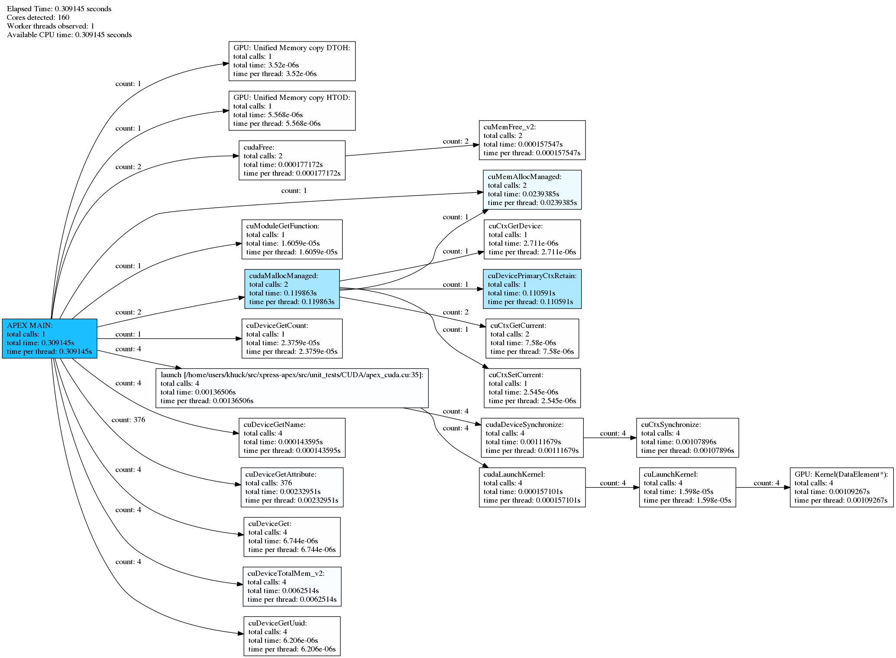
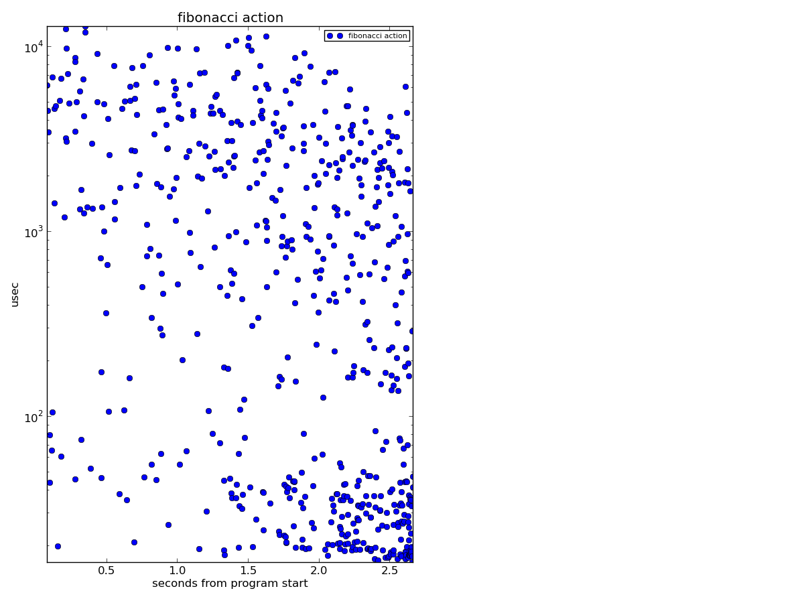
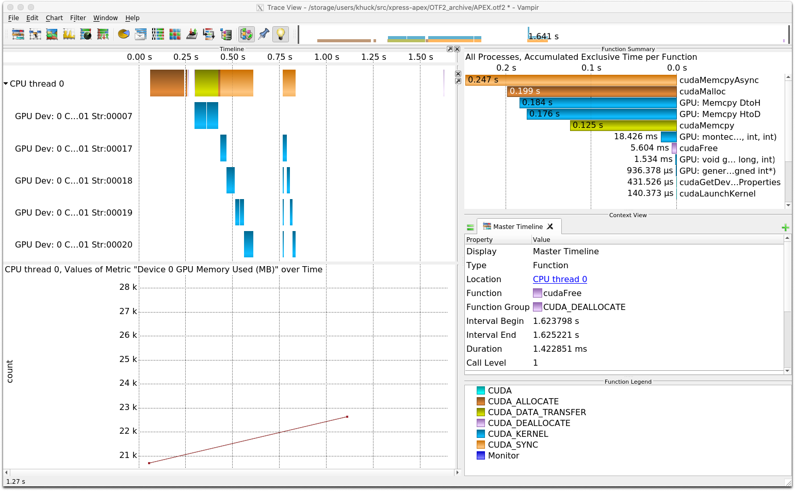

# Usage

## Tutorial

For an APEX tutorial, please see <https://github.com/khuck/apex-tutorial>.

## Supported Runtime Systems

### HPX (Louisiana State University)

HPX (High Performance ParalleX) is the original implementation of the ParalleX
model. Developed and maintained by the Ste||ar Group at Louisiana State
University, HPX is implemented in C++. For more information, see
<http://stellar-group.org/projects/hpx/>.  For a tutorial on HPX with APEX
(presented at SC'15, Austin TX) see
<https://github.com/khuck/SC15_APEX_tutorial> (somewhat outdated).

APEX is configured and built as part of HPX. In fact, you don't even need to
donwload it separately - it will be automatically checked out from Github as
part of the HPX Cmake configuration.  However, you do need to pass the correct
Cmake options to the HPX configuration step.

#### Configuring HPX with APEX

See [Intallation with HPX](install.md#installation_with_hpx).

#### Running HPX with APEX

See [APEX Quickstart](quickstarthpx.md#runtime).

### OpenMP

The OpenMP API supports multi-platform shared-memory parallel programming in C/C++ and Fortran. The OpenMP API defines a portable, scalable model with a simple and flexible interface for developing parallel applications on platforms from the desktop to the supercomputer.  For more information, see <http://openmp.org/>.

#### Configuring APEX for OpenMP OMPT support

The CMake process will automatically detect whether your compiler has OpenMP support.  If you configure APEX with `-DUSE_OMPT=TRUE` and have a compiler with full OpenMP 5.0 OMPT support, APEX will detect the support.  If your compiler is GCC, Intel or Clang and does *not* have native OMPT support, APEX can build and use the open source LLVM OpenMP runtime as a drop-in replacement for the compiler's native runtime library, but this is no longer recommended and is deprecated.

APEX uses Binutils to resolve the OpenMP outlined regions from instruction addresses to human-readable names, so also configure APEX with `-DUSE_BFD=TRUE` (see [Other CMake Settings](install.md#other_cmake_settings_depending_on_your_needswants)).  The following example was configured and run with Intel 20 compilers.  The CMake configuration for this example was:

```
cmake -DCMAKE_C_COMPILER=`which icc` -DCMAKE_CXX_COMPILER=`which icpc` -DCMAKE_BUILD_TYPE=Release -DCMAKE_INSTALL_PREFIX=../install -DBUILD_TESTS=TRUE -DUSE_BFD=TRUE -DBFD_ROOT=/usr/local/packages/binutils/2.34 -DUSE_OMPT=TRUE ..
```

#### Running OpenMP applications with APEX

Using the `apex_exec` wrapper script, execute the OpenMP program as normal:

```
[khuck@delphi apex]$ ./install/bin/apex_exec --apex:screen --apex:taskgraph --apex:ompt build/src/unit_tests/C++/apex_openmp_cpp
Program to run :  build/src/unit_tests/C++/apex_openmp_cpp
Initializing...
No Sharing...
Result: 2690568.772590

Elapsed time: 0.0398378 seconds
Cores detected: 72
Worker Threads observed: 72
Available CPU time: 2.86832 seconds

Counter                                   : #samples | minimum |    mean  |  maximum |  stddev
------------------------------------------------------------------------------------------------
Iterations: OpenMP Work Loop: no_shari... :       71   1.05e+06   1.05e+06   1.05e+06      0.000
Iterations: OpenMP Work Loop: my_init(... :      144   1.05e+06   1.05e+06   1.05e+06      0.000
                    OpenMP Initial Thread :        1      1.000      1.000      1.000      0.000
                     OpenMP Worker Thread :       71      1.000      1.000      1.000      0.000
Single: OpenMP Work Single Executor: L... :        1      1.000      1.000      1.000      0.000
Single: OpenMP Work Single Executor: L... :        2      1.000      1.000      1.000      0.000
Single: OpenMP Work Single Other: L__Z... :       71      1.000      1.000      1.000      0.000
Single: OpenMP Work Single Other: L__Z... :      142      1.000      1.000      1.000      0.000
                           status:Threads :        1      3.000      3.000      3.000      0.000
                            status:VmData :        1   1.07e+05   1.07e+05   1.07e+05      0.000
                             status:VmExe :        1     20.000     20.000     20.000      0.000
                             status:VmHWM :        1   9356.000   9356.000   9356.000      0.000
                             status:VmLck :        1      0.000      0.000      0.000      0.000
                             status:VmLib :        1   4.39e+04   4.39e+04   4.39e+04      0.000
                             status:VmPTE :        1    128.000    128.000    128.000      0.000
                            status:VmPeak :        1   2.49e+05   2.49e+05   2.49e+05      0.000
                             status:VmPin :        1      0.000      0.000      0.000      0.000
                             status:VmRSS :        1   9356.000   9356.000   9356.000      0.000
                            status:VmSize :        1   1.84e+05   1.84e+05   1.84e+05      0.000
                             status:VmStk :        1    136.000    136.000    136.000      0.000
                            status:VmSwap :        1      0.000      0.000      0.000      0.000
        status:nonvoluntary_ctxt_switches :        1     43.000     43.000     43.000      0.000
           status:voluntary_ctxt_switches :        1     46.000     46.000     46.000      0.000
------------------------------------------------------------------------------------------------

Timer                                                : #calls  |    mean  |   total  |  % total
------------------------------------------------------------------------------------------------
                                           APEX MAIN :        1      0.040      0.040    100.000
OpenMP Parallel Region: no_sharing(double*, doubl... :        1      0.006      0.006      0.211
OpenMP Parallel Region: my_init(double*) [{/home/... :        2      0.014      0.028      0.961
OpenMP Work Loop: no_sharing(double*, double*) [{... :       72      0.003      0.195      6.806
OpenMP Work Loop: my_init(double*) [{/home/users/... :      143      0.001      0.161      5.622
OpenMP Work Single Executor: L__Z10no_sharingPdS_... :        1      0.001      0.001      0.028
OpenMP Work Single Executor: L__Z7my_initPd_39__p... :        2      0.000      0.001      0.018
OpenMP Work Single Other: L__Z10no_sharingPdS__20... :       71      0.000      0.029      1.027
OpenMP Work Single Other: L__Z7my_initPd_39__par_... :      141      0.001      0.100      3.472
------------------------------------------------------------------------------------------------
                                        Total timers : 433
```

If GraphViz is installed on your system, the `dot` program will generate a taskgraph image based on the taskgraph.0.dot file that was generated by APEX:



### OpenACC

#### Configuring APEX for OpenACC support

Nothing special needs to be done to enable OpenACC support.  If your compiler supports OpenACC (PGI, GCC 10+), then CMake will detect it and enable OpenACC support in APEX.

In this example, APEX was configured with GCC 10.0.0:

```
cmake -DCMAKE_C_COMPILER=`which gcc` -DCMAKE_CXX_COMPILER=`which g++` -DCMAKE_BUILD_TYPE=Release -DCMAKE_INSTALL_PREFIX=../install -DBUILD_TESTS=TRUE -DUSE_BFD=FALSE -DBFD_ROOT=/usr/local/packages/binutils/2.34 ..
```

#### Running OpenACC programs with APEX

Enabling OpenACC support requires setting the `ACC_PROFLIB` environment variable with the path to `libapex.so`, or by using the `apex_exec` script with the `--apex:openacc` flag:

```
[khuck@gorgon apex]$ ./install/bin/apex_exec --apex:screen --apex:taskgraph --apex:openacc ./build/src/unit_tests/C/apex_openacc
Program to run :  ./build/src/unit_tests/C/apex_openacc
Jacobi relaxation Calculation: 128 x 128 mesh
Device API: none Device type: default Device vendor: -1
Device API: CUDA Device type: nvidia Device vendor: -1
    0, 0.250000

Elapsed time: 0.451705 seconds
Cores detected: 160
Worker Threads observed: 1
Available CPU time: 0.451705 seconds

Counter                                   : #samples | minimum |    mean  |  maximum |  stddev
------------------------------------------------------------------------------------------------
                            OpenACC Gangs :      200      1.000   2560.500   5120.000   2559.500
                     OpenACC Vector Lanes :      200     32.000     32.000     32.000      0.000
                          OpenACC Workers :      200      1.000      1.000      1.000      0.000
OpenACC device alloc (implicit) parall... :      301     15.000    889.206   2.62e+05   1.51e+04
OpenACC device free (implicit) paralle... :      301      0.000      0.000      0.000      0.000
OpenACC enqueue data transfer (HtoD) (... :      200     16.000     20.000     24.000      4.000
                           status:Threads :        1      3.000      3.000      3.000      0.000
                            status:VmData :        1   1.81e+04   1.81e+04   1.81e+04      0.000
                             status:VmExe :        1     64.000     64.000     64.000      0.000
                             status:VmHWM :        1   4416.000   4416.000   4416.000      0.000
                             status:VmLck :        1      0.000      0.000      0.000      0.000
                             status:VmLib :        1   8640.000   8640.000   8640.000      0.000
                             status:VmPMD :        1     16.000     16.000     16.000      0.000
                             status:VmPTE :        1      3.000      3.000      3.000      0.000
                            status:VmPeak :        1   1.59e+05   1.59e+05   1.59e+05      0.000
                             status:VmPin :        1      0.000      0.000      0.000      0.000
                             status:VmRSS :        1   4416.000   4416.000   4416.000      0.000
                            status:VmSize :        1   9.34e+04   9.34e+04   9.34e+04      0.000
                             status:VmStk :        1    192.000    192.000    192.000      0.000
                            status:VmSwap :        1      0.000      0.000      0.000      0.000
        status:nonvoluntary_ctxt_switches :        1      0.000      0.000      0.000      0.000
           status:voluntary_ctxt_switches :        1     46.000     46.000     46.000      0.000
------------------------------------------------------------------------------------------------

Timer                                                : #calls  |    mean  |   total  |  % total
------------------------------------------------------------------------------------------------
                                           APEX MAIN :        1      0.452      0.452    100.000
                  OpenACC compute construct parallel :      200      0.001      0.215     47.492
             OpenACC device init (implicit) parallel :        1      0.081      0.081     17.965
OpenACC enqueue data transfer (HtoD) (implicit) p... :      200      0.000      0.002      0.523
OpenACC enqueue launch: main$_omp_fn$0 (implicit)... :      100      0.000      0.001      0.288
OpenACC enqueue launch: main$_omp_fn$1 (implicit)... :      100      0.000      0.001      0.267
              OpenACC enter data (implicit) parallel :      200      0.000      0.002      0.491
                             OpenACC enter data data :        1      0.000      0.000      0.078
               OpenACC exit data (implicit) parallel :      200      0.000      0.003      0.733
                              OpenACC exit data data :        1      0.000      0.000      0.043
                                           APEX Idle :                          0.145     32.120
------------------------------------------------------------------------------------------------
                                        Total timers : 1003
```



### CUDA

#### Configuring APEX for CUDA support

Enabling CUDA support in APEX requires the `-DAPEX_WITH_CUDA=TRUE` flag and the `-DCUDA_ROOT=/path/to/cuda` CMake variables at configuration time.  CMake will look for the CUPTI and NVML libraries in the installation, and if found the support will be enabled.

```
cmake -DCMAKE_C_COMPILER=`which gcc` -DCMAKE_CXX_COMPILER=`which g++` -DCMAKE_BUILD_TYPE=Release -DCMAKE_INSTALL_PREFIX=../install -DBUILD_TESTS=TRUE -DUSE_BFD=TRUE -DAPEX_WITH_CUDA=TRUE -DCUDA_ROOT=/usr/local/packages/cuda/10.2 -DBFD_ROOT=/usr/local/packages/binutils/2.34 ..
```

#### Running CUDA programs with APEX

Enabling CUDA support only requires using the `apex_exec` wrapper script.

```
[khuck@gorgon apex]$ ./install/bin/apex_exec --apex:screen --apex:taskgraph --apex:cuda ./build/src/unit_tests/CUDA/apex_cuda_cu
Program to run :  ./build/src/unit_tests/CUDA/apex_cuda_cu
On device: name=hello, value=10
On device: name=dello, value=11
On device: name=dello, value=12
On device: name=dello, value=13
On host: name=dello, value=14

Elapsed time: 0.410402 seconds
Cores detected: 160
Worker Threads observed: 1
Available CPU time: 0.410402 seconds

Counter                                   : #samples | minimum |    mean  |  maximum |  stddev
------------------------------------------------------------------------------------------------
          Device 0 GPU Clock Memory (MHz) :        1    877.000    877.000    877.000      0.000
              Device 0 GPU Clock SM (MHz) :        1    135.000    135.000    135.000      0.000
            Device 0 GPU Memory Free (MB) :        1   3.41e+04   3.41e+04   3.41e+04      0.000
            Device 0 GPU Memory Used (MB) :        1      0.197      0.197      0.197      0.000
        Device 0 GPU Memory Utilization % :        1      0.000      0.000      0.000      0.000
           Device 0 GPU NvLink Link Count :        1      6.000      6.000      6.000      0.000
           Device 0 GPU NvLink Speed MB/s :        1   2.58e+04   2.58e+04   2.58e+04      0.000
       Device 0 GPU NvLink Utilization C0 :        1      0.000      0.000      0.000      0.000
       Device 0 GPU NvLink Utilization C1 :        1      0.000      0.000      0.000      0.000
                   Device 0 GPU Power (W) :        1     38.912     38.912     38.912      0.000
             Device 0 GPU Temperature (C) :        1     33.000     33.000     33.000      0.000
               Device 0 GPU Utilization % :        1      0.000      0.000      0.000      0.000
       Device 0 PCIe RX Throughput (MB/s) :        1      1.000      1.000      1.000      0.000
       Device 0 PCIe TX Throughput (MB/s) :        1      3.000      3.000      3.000      0.000
                     GPU: Bytes Allocated :        2      6.000     11.000     16.000      5.000
                           status:Threads :        1      4.000      4.000      4.000      0.000
                            status:VmData :        1   5.72e+04   5.72e+04   5.72e+04      0.000
                             status:VmExe :        1     64.000     64.000     64.000      0.000
                             status:VmHWM :        1   1.77e+04   1.77e+04   1.77e+04      0.000
                             status:VmLck :        1      0.000      0.000      0.000      0.000
                             status:VmLib :        1   6.92e+04   6.92e+04   6.92e+04      0.000
                             status:VmPMD :        1     12.000     12.000     12.000      0.000
                             status:VmPTE :        1      7.000      7.000      7.000      0.000
                            status:VmPeak :        1   2.58e+05   2.58e+05   2.58e+05      0.000
                             status:VmPin :        1      0.000      0.000      0.000      0.000
                             status:VmRSS :        1   1.77e+04   1.77e+04   1.77e+04      0.000
                            status:VmSize :        1   1.93e+05   1.93e+05   1.93e+05      0.000
                             status:VmStk :        1    192.000    192.000    192.000      0.000
                            status:VmSwap :        1      0.000      0.000      0.000      0.000
        status:nonvoluntary_ctxt_switches :        1      0.000      0.000      0.000      0.000
           status:voluntary_ctxt_switches :        1    102.000    102.000    102.000      0.000
------------------------------------------------------------------------------------------------

Timer                                                : #calls  |    mean  |   total  |  % total
------------------------------------------------------------------------------------------------
                                           APEX MAIN :        1      0.410      0.410    100.000
                       GPU: Unified Memory copy DTOH :        1      0.000      0.000      0.001
                       GPU: Unified Memory copy HTOD :        1      0.000      0.000      0.001
                           GPU: Kernel(DataElement*) :        4      0.000      0.000      0.084
                               cudaDeviceSynchronize :        4      0.000      0.000      0.092
                                            cudaFree :        2      0.000      0.000      0.045
                                    cudaLaunchKernel :        4      0.000      0.000      0.007
                                   cudaMallocManaged :        2      0.104      0.208     50.601
launch [/home/users/khuck/src/apex/src/unit_tests... :        4      0.001      0.003      0.798
                                           APEX Idle :                          0.199     48.371
------------------------------------------------------------------------------------------------
                                        Total timers : 22

```

To get additional information you can also enable the `--apex:cuda_driver` flag to see CUDA driver API calls, or enable the `--apex:cuda_counters` flag to enable CUDA counters.

```
[khuck@gorgon apex]$ ./install/bin/apex_exec --apex:screen --apex:taskgraph --apex:cuda --apex:cuda_counters --apex:cuda_driver ./build/src/unit_tests/CUDA/apex_cuda_cu
Program to run :  ./build/src/unit_tests/CUDA/apex_cuda_cu
On device: name=hello, value=10
On device: name=dello, value=11
On device: name=dello, value=12
On device: name=dello, value=13
On host: name=dello, value=14

Elapsed time: 0.309145 seconds
Cores detected: 160
Worker Threads observed: 1
Available CPU time: 0.309145 seconds

Counter                                   : #samples | minimum |    mean  |  maximum |  stddev
------------------------------------------------------------------------------------------------
          Device 0 GPU Clock Memory (MHz) :        1    877.000    877.000    877.000      0.000
              Device 0 GPU Clock SM (MHz) :        1    135.000    135.000    135.000      0.000
            Device 0 GPU Memory Free (MB) :        1   3.41e+04   3.41e+04   3.41e+04      0.000
            Device 0 GPU Memory Used (MB) :        1      0.197      0.197      0.197      0.000
        Device 0 GPU Memory Utilization % :        1      0.000      0.000      0.000      0.000
           Device 0 GPU NvLink Link Count :        1      6.000      6.000      6.000      0.000
           Device 0 GPU NvLink Speed MB/s :        1   2.58e+04   2.58e+04   2.58e+04      0.000
       Device 0 GPU NvLink Utilization C0 :        1      0.000      0.000      0.000      0.000
       Device 0 GPU NvLink Utilization C1 :        1      0.000      0.000      0.000      0.000
                   Device 0 GPU Power (W) :        1     38.912     38.912     38.912      0.000
             Device 0 GPU Temperature (C) :        1     33.000     33.000     33.000      0.000
               Device 0 GPU Utilization % :        1      0.000      0.000      0.000      0.000
       Device 0 PCIe RX Throughput (MB/s) :        1      2.000      2.000      2.000      0.000
       Device 0 PCIe TX Throughput (MB/s) :        1      3.000      3.000      3.000      0.000
GPU: Bandwith (GB/s) <- Unified Memory... :        1     18.618     18.618     18.618      0.000
GPU: Bandwith (GB/s) <- Unified Memory... :        1     11.770     11.770     11.770      0.000
   GPU: Bytes <- Unified Memory copy DTOH :        1   6.55e+04   6.55e+04   6.55e+04      0.000
   GPU: Bytes <- Unified Memory copy HTOD :        1   6.55e+04   6.55e+04   6.55e+04      0.000
                     GPU: Bytes Allocated :        3      0.000      7.333     16.000      6.600
           GPU: Dynamic Shared Memory (B) :        4      0.000      0.000      0.000      0.000
         GPU: Local Memory Per Thread (B) :        4      0.000      0.000      0.000      0.000
              GPU: Local Memory Total (B) :        4   1.36e+08   1.36e+08   1.36e+08      0.000
                GPU: Registers Per Thread :        4     32.000     32.000     32.000      0.000
              GPU: Shared Memory Size (B) :        4      0.000      0.000      0.000      0.000
            GPU: Static Shared Memory (B) :        4      0.000      0.000      0.000      0.000
      Unified Memory CPU Page Fault Count :        2      1.000      1.000      1.000      0.000
     Unified Memory GPU Page Fault Groups :        1      1.000      1.000      1.000      0.000
                           status:Threads :        1      4.000      4.000      4.000      0.000
                            status:VmData :        1   5.69e+04   5.69e+04   5.69e+04      0.000
                             status:VmExe :        1     64.000     64.000     64.000      0.000
                             status:VmHWM :        1   1.70e+04   1.70e+04   1.70e+04      0.000
                             status:VmLck :        1      0.000      0.000      0.000      0.000
                             status:VmLib :        1   6.92e+04   6.92e+04   6.92e+04      0.000
                             status:VmPMD :        1     16.000     16.000     16.000      0.000
                             status:VmPTE :        1      7.000      7.000      7.000      0.000
                            status:VmPeak :        1   2.58e+05   2.58e+05   2.58e+05      0.000
                             status:VmPin :        1      0.000      0.000      0.000      0.000
                             status:VmRSS :        1   1.70e+04   1.70e+04   1.70e+04      0.000
                            status:VmSize :        1   1.93e+05   1.93e+05   1.93e+05      0.000
                             status:VmStk :        1    192.000    192.000    192.000      0.000
                            status:VmSwap :        1      0.000      0.000      0.000      0.000
        status:nonvoluntary_ctxt_switches :        1      0.000      0.000      0.000      0.000
           status:voluntary_ctxt_switches :        1    100.000    100.000    100.000      0.000
------------------------------------------------------------------------------------------------

Timer                                                : #calls  |    mean  |   total  |  % total
------------------------------------------------------------------------------------------------
                                           APEX MAIN :        1      0.309      0.309    100.000
                       GPU: Unified Memory copy DTOH :        1      0.000      0.000      0.001
                       GPU: Unified Memory copy HTOD :        1      0.000      0.000      0.002
                           GPU: Kernel(DataElement*) :        4      0.000      0.001      0.353
                                     cuCtxGetCurrent :        2      0.000      0.000      0.002
                                      cuCtxGetDevice :        1      0.000      0.000      0.001
                                     cuCtxSetCurrent :        1      0.000      0.000      0.001
                                    cuCtxSynchronize :        4      0.000      0.001      0.349
                                         cuDeviceGet :        4      0.000      0.000      0.002
                                cuDeviceGetAttribute :      376      0.000      0.002      0.754
                                    cuDeviceGetCount :        1      0.000      0.000      0.008
                                     cuDeviceGetName :        4      0.000      0.000      0.046
                                     cuDeviceGetUuid :        4      0.000      0.000      0.002
                            cuDevicePrimaryCtxRetain :        1      0.111      0.111     35.773
                                 cuDeviceTotalMem_v2 :        4      0.002      0.006      2.022
                                      cuLaunchKernel :        4      0.000      0.000      0.005
                                   cuMemAllocManaged :        2      0.012      0.024      7.743
                                        cuMemFree_v2 :        2      0.000      0.000      0.051
                                 cuModuleGetFunction :        1      0.000      0.000      0.005
                               cudaDeviceSynchronize :        4      0.000      0.001      0.361
                                            cudaFree :        2      0.000      0.000      0.057
                                    cudaLaunchKernel :        4      0.000      0.000      0.051
                                   cudaMallocManaged :        2      0.060      0.120     38.773
launch [/home/users/khuck/src/apex/src/unit_tests... :        4      0.000      0.001      0.442
                                           APEX Idle :                          0.041     13.195
------------------------------------------------------------------------------------------------
                                        Total timers : 433
```



The following flags will enable different types of CUDA support:
```
    --apex:cuda                   enable CUDA/CUPTI measurement (default: off)
    --apex:cuda-counters          enable CUDA/CUPTI counter support (default: off)
    --apex:cuda-driver            enable CUDA driver API callbacks (default: off)
    --apex:cuda-details           enable per-kernel statistics where available (default: off)
    --apex:monitor-gpu            enable GPU monitoring services (CUDA NVML, ROCm SMI)
```

### HIP/ROCm

APEX suports HIP measurement using the Roc* libraries provided by AMD.

#### Configuring APEX for HIP support

Enabling HIP support in APEX requires the `-DAPEX_WITH_HIP=TRUE` flag and the `-DROCM_ROOT=/path/to/rocm` CMake variables at configuration time.  CMake will look for the profile/trace and smi libraries in the installation, and if found the support will be enabled.

```
cmake -B build -DCMAKE_C_COMPILER=`which clang` -DCMAKE_CXX_COMPILER=`which hipcc` -DCMAKE_BUILD_TYPE=Release -DCMAKE_INSTALL_PREFIX=./install -DBUILD_TESTS=TRUE -DUSE_BFD=TRUE -DAPEX_WITH_HIP=TRUE -DROCM_ROOT=/opt/rocm-5.7.1 -DBFD_ROOT=/usr/local/packages/binutils/2.34 ..
```

#### Running HIP programs with APEX
Enabling CUDA support only requires using the `apex_exec` wrapper script. The following flags will enable additional support:
```
    --apex:hip                    enable HIP/ROCTracer measurement (default: off)
    --apex:hip-metrics            enable HIP/ROCProfiler metric support (default: off)
    --apex:hip-counters           enable HIP/ROCTracer counter support (default: off)
    --apex:hip-driver             enable HIP/ROCTracer KSA driver API callbacks (default: off)
    --apex:hip-details            enable per-kernel statistics where available (default: off)
    --apex:monitor-gpu            enable GPU monitoring services (CUDA NVML, ROCm SMI)
```

### Kokkos

#### Configuring APEX for Kokkos support

Like OpenACC, nothing special needs to be done to enable Kokkos support.

#### Running Kokkos programs with APEX

Enabling Kokkos support requires setting the `KOKKOS_PROFILE_LIBRARY` environment variable with the path to `libapex.so`, or by using the `apex_exec` script with the `--apex:kokkos` flag. We also recommend using the `--apex:kokkos-fence` option which will time the full kernel execution time, not just the time to launch a kernel if the back-end activity is not measured by some other method (OMPT, CUDA, HIP, SYCL, OpenACC). APEX also has experimental autotuning support for Kokkos kernels, see <https://github.com/UO-OACISS/apex/wiki/Using-APEX-with-Kokkos#autotuning-support>.

#### Configuring APEX for RAJA support

Like OpenACC, nothing special needs to be done to enable RAJA support.

#### Running RAJA programs with APEX

Enabling RAJA support requires setting the `RAJA_PLUGINS` environment variable with the path to `libapex.so`, or by using the `apex_exec` script with the `--apex:raja` flag.
The following flags will enable different types of Kokkos support:
```
    --apex:kokkos                 enable Kokkos support
    --apex:kokkos-tuning          enable Kokkos runtime autotuning support
    --apex:kokkos-fence           enable Kokkos fences for async kernels
```

### C++ Threads

APEX suports C++ threads on Linux, with the assumption that they are implemented on top of POSIX threads.

#### Configuring APEX for C++ Thread support

Nothing special needs to be done to enable C++ thread support.

#### Running C++ Thread programs with APEX

Enabling C++ Thread support requires using the `apex_exec` script with the `--apex:pthread` flag.  That will enable the preloading of a wrapper library to intercept `pthread_create()` calls.  A sample program with C++ threads is in the APEX unit tests:

```
khuck@Kevins-MacBook-Air build % ../install/bin/apex_exec --apex:pthread src/unit_tests/C++/apex_fibonacci_std_async_cpp
Program to run :  src/unit_tests/C++/apex_fibonacci_std_async_cpp
usage: apex_fibonacci_std_async_cpp <integer value>
Using default value of 10
fib of 10 is 55 (valid value: 55)

Elapsed time: 0.005359 seconds
Cores detected: 8
Worker Threads observed: 178
Available CPU time: 0.042872 seconds

Timer                                                : #calls  |    mean  |   total  |  % total
------------------------------------------------------------------------------------------------
  fib(int, std::__1::shared_ptr<apex::task_wrapper>) :      177      0.001      0.171    --n/a--
                                           APEX MAIN :        1      0.005      0.005    100.000
------------------------------------------------------------------------------------------------
                                        Total timers : 177
```
Note that APEX detected 178 total OS threads.  That is because some C++ thread implementations (GCC, Clang, others) implement *every* `std::async()` call as a new OS thread, resulting in a `pthread_create()` call.

### Other Runtime Systems

We are currently evaluating support for TBB, OpenCL, SYCL/DPC++/OneAPI, among others.

## Performance Measurement Features

For all the following examples, we will use a simple CUDA program that is in the APEX unit tests.

### Profiling

Profiling with APEX is the usual and most simple mode of operation.  In order to profile an application and get a report at the end of execution, enable screen output (see [Environment Variables](/environment) for details) and run an application linked with the APEX library or with the `apex_exec --apex:screen` flag (enabled by default).  The output should look like examples shown previously.

```bash
[khuck@cyclops apex]$ export APEX_SCREEN_OUTPUT=1
[khuck@cyclops apex]$ ./build/src/unit_tests/CUDA/apex_cuda_cu
Found 4 total devices
On device: name=hello, value=10
On device: name=dello, value=11
On device: name=dello, value=12
On device: name=dello, value=13
On host: name=dello, value=14

Elapsed time: 0.46147 seconds
Cores detected: 160
Worker Threads observed: 1
Available CPU time: 0.46147 seconds

Counter                                   : #samples | minimum |    mean  |  maximum |  stddev
------------------------------------------------------------------------------------------------
                    1 Minute Load average :        1     13.320     13.320     13.320      0.000
          Device 0 GPU Clock Memory (MHz) :        1    877.000    877.000    877.000      0.000
              Device 0 GPU Clock SM (MHz) :        1   1530.000   1530.000   1530.000      0.000
            Device 0 GPU Memory Free (MB) :        1   1.34e+04   1.34e+04   1.34e+04      0.000
            Device 0 GPU Memory Used (MB) :        1   2.07e+04   2.07e+04   2.07e+04      0.000
        Device 0 GPU Memory Utilization % :        1     48.000     48.000     48.000      0.000
           Device 0 GPU NvLink Link Count :        1      6.000      6.000      6.000      0.000
           Device 0 GPU NvLink Speed MB/s :        1   2.58e+04   2.58e+04   2.58e+04      0.000
       Device 0 GPU NvLink Utilization C0 :        1      0.000      0.000      0.000      0.000
       Device 0 GPU NvLink Utilization C1 :        1      0.000      0.000      0.000      0.000
                   Device 0 GPU Power (W) :        1    240.573    240.573    240.573      0.000
             Device 0 GPU Temperature (C) :        1     73.000     73.000     73.000      0.000
               Device 0 GPU Utilization % :        1     95.000     95.000     95.000      0.000
       Device 0 PCIe RX Throughput (MB/s) :        1      5.000      5.000      5.000      0.000
       Device 0 PCIe TX Throughput (MB/s) :        1      0.000      0.000      0.000      0.000
                     GPU: Bytes Allocated :        2      6.000     11.000     16.000      5.000
                           status:Threads :        1      7.000      7.000      7.000      0.000
                            status:VmData :        1   2.77e+05   2.77e+05   2.77e+05      0.000
                             status:VmExe :        1     64.000     64.000     64.000      0.000
                             status:VmHWM :        1   2.19e+05   2.19e+05   2.19e+05      0.000
                             status:VmLck :        1      0.000      0.000      0.000      0.000
                             status:VmLib :        1   8.74e+04   8.74e+04   8.74e+04      0.000
                             status:VmPMD :        1     16.000     16.000     16.000      0.000
                             status:VmPTE :        1     35.000     35.000     35.000      0.000
                            status:VmPeak :        1   7.17e+05   7.17e+05   7.17e+05      0.000
                             status:VmPin :        1   1.67e+05   1.67e+05   1.67e+05      0.000
                             status:VmRSS :        1   2.19e+05   2.19e+05   2.19e+05      0.000
                            status:VmSize :        1   6.52e+05   6.52e+05   6.52e+05      0.000
                             status:VmStk :        1    192.000    192.000    192.000      0.000
                            status:VmSwap :        1      0.000      0.000      0.000      0.000
        status:nonvoluntary_ctxt_switches :        1      9.000      9.000      9.000      0.000
           status:voluntary_ctxt_switches :        1   1331.000   1331.000   1331.000      0.000
------------------------------------------------------------------------------------------------

Timer                                                : #calls  |    mean  |   total  |  % total
------------------------------------------------------------------------------------------------
                                           APEX MAIN :        1      0.461      0.461    100.000
                            GPU: Unified Memcpy DTOH :        1      0.000      0.000      0.001
                            GPU: Unified Memcpy HTOD :        1      0.000      0.000      0.001
                           GPU: Kernel(DataElement*) :        4      0.000      0.000      0.086
                               cudaDeviceSynchronize :        4      0.000      0.001      0.169
                                            cudaFree :        2      0.000      0.000      0.052
                                    cudaLaunchKernel :        4      0.000      0.000      0.021
                                   cudaMallocManaged :        2      0.135      0.269     58.397
launch [/home/users/khuck/src/apex/src/unit_tests... :        4      0.028      0.110     23.870
                                           APEX Idle :                          0.080     17.403
------------------------------------------------------------------------------------------------
                                        Total timers : 22
```

### Profiling with CSV output

To enable CSV output, use one of the methods described in the [Environment Variables](/environment) page, and run as the previous example.

```bash
[khuck@cyclops apex]$ export APEX_CSV_OUTPUT=1
[khuck@cyclops apex]$ ./build/src/unit_tests/CUDA/apex_cuda_cu
Found 4 total devices
On device: name=hello, value=10
On device: name=dello, value=11
On device: name=dello, value=12
On device: name=dello, value=13
On host: name=dello, value=14

[khuck@cyclops apex]$ cat apex.0.csv
"counter","num samples","minimum","mean""maximum","stddev"
"1 Minute Load average",1,22,22,22,0
"Device 0 GPU Clock Memory (MHz)",1,877,877,877,0
"Device 0 GPU Clock SM (MHz)",1,1530,1530,1530,0
"Device 0 GPU Memory Free (MB)",1,13411,13411,13411,0
"Device 0 GPU Memory Used (MB)",1,20679,20679,20679,0
"Device 0 GPU Memory Utilization %",1,58,58,58,0
"Device 0 GPU NvLink Link Count",1,6,6,6,0
"Device 0 GPU NvLink Speed MB/s",1,25781,25781,25781,0
"Device 0 GPU NvLink Utilization C0",1,0,0,0,0
"Device 0 GPU NvLink Utilization C1",1,0,0,0,0
"Device 0 GPU Power (W)",1,255,255,255,0
"Device 0 GPU Temperature (C)",1,75,75,75,0
"Device 0 GPU Utilization %",1,99,99,99,0
"Device 0 PCIe RX Throughput (MB/s)",1,7,7,7,0
"Device 0 PCIe TX Throughput (MB/s)",1,2,2,2,0
"GPU: Bytes Allocated",2,6,11,16,5
"status:Threads",1,7,7,7,0
"status:VmData",1,277120,277120,277120,0
"status:VmExe",1,64,64,64,0
"status:VmHWM",1,219008,219008,219008,0
"status:VmLck",1,0,0,0,0
"status:VmLib",1,87424,87424,87424,0
"status:VmPMD",1,16,16,16,0
"status:VmPTE",1,36,36,36,0
"status:VmPeak",1,717248,717248,717248,0
"status:VmPin",1,166528,166528,166528,0
"status:VmRSS",1,219008,219008,219008,0
"status:VmSize",1,652032,652032,652032,0
"status:VmStk",1,192,192,192,0
"status:VmSwap",1,0,0,0,0
"status:nonvoluntary_ctxt_switches",1,8,8,8,0
"status:voluntary_ctxt_switches",1,1276,1276,1276,0


"task","num calls","total cycles","total microseconds"
"APEX MAIN",1,0,431162
"GPU: Unified Memcpy DTOH",1,0,3
"GPU: Unified Memcpy HTOD",1,0,4
"GPU: Kernel(DataElement*)",4,0,1082
"cudaDeviceSynchronize",4,0,9993
"cudaFree",2,0,172
"cudaLaunchKernel",4,0,66
"cudaMallocManaged",2,0,194367
"launch [/home/users/khuck/src/apex/src/unit_tests/CUDA/apex_cuda.cu:35]",4,0,164490
```

### Profiling with TAU profile output

To enable TAU profile output, use one of the methods described in the [Environment Variables](/environment) page, and run as the previous example.  The output can be summarized with the TAU `pprof` command, which is installed with the TAU software.

```bash
[khuck@cyclops apex]$ export APEX_CSV_OUTPUT=1
[khuck@cyclops apex]$ ./build/src/unit_tests/CUDA/apex_cuda_cu
Found 4 total devices
On device: name=hello, value=10
On device: name=dello, value=11
On device: name=dello, value=12
On device: name=dello, value=13
On host: name=dello, value=14

[khuck@cyclops apex]$ cat profile.0.0.0
9 templated_functions_MULTI_TIME
# Name Calls Subrs Excl Incl ProfileCalls #
"GPU: Unified Memcpy DTOH" 1 0 2.656 2.656 0 GROUP="TAU_USER"
"cudaFree" 2 0 193.18 193.18 0 GROUP="TAU_USER"
"cudaMallocManaged" 2 0 184435 184435 0 GROUP="TAU_USER"
"GPU: Unified Memcpy HTOD" 1 0 4.64 4.64 0 GROUP="TAU_USER"
"GPU: Kernel(DataElement*)" 4 0 355.293 355.293 0 GROUP="TAU_USER"
"cudaLaunchKernel" 4 0 67.4 67.4 0 GROUP="TAU_USER"
"cudaDeviceSynchronize" 4 0 811.244 811.244 0 GROUP="TAU_USER"
"launch [/home/users/khuck/src/apex/src/unit_tests/CUDA/apex_cuda.cu:35]" 4 0 100327 100327 0 GROUP="TAU_USER"
"APEX MAIN" 1 0 67830.2 354026 0 GROUP="TAU_USER"
0 aggregates
32 userevents
# eventname numevents max min mean sumsqr
"status:VmSwap" 1 0 0 0 0
"status:VmSize" 1 652032 652032 652032 4.25146e+11
"status:Threads" 1 7 7 7 49
"status:VmPeak" 1 717248 717248 717248 5.14445e+11
"Device 0 GPU Power (W)" 1 224.057 224.057 224.057 50201.5
"Device 0 GPU NvLink Speed MB/s" 1 25781 25781 25781 6.6466e+08
"status:VmExe" 1 64 64 64 4096
"status:nonvoluntary_ctxt_switches" 1 12 12 12 144
"Device 0 GPU Memory Utilization %" 1 73 73 73 5329
"status:VmStk" 1 192 192 192 36864
"status:VmData" 1 277120 277120 277120 7.67955e+10
"status:VmLck" 1 0 0 0 0
"status:VmPin" 1 166528 166528 166528 2.77316e+10
"status:VmPTE" 1 35 35 35 1225
"Device 0 GPU NvLink Utilization C1" 1 0 0 0 0
"status:VmHWM" 1 219008 219008 219008 4.79645e+10
"status:VmRSS" 1 219008 219008 219008 4.79645e+10
"GPU: Bytes Allocated" 2 16 6 11 292
"status:VmLib" 1 87424 87424 87424 7.64296e+09
"Device 0 GPU Utilization %" 1 99 99 99 9801
"status:voluntary_ctxt_switches" 1 1320 1320 1320 1.7424e+06
"Device 0 GPU Clock SM (MHz)" 1 1530 1530 1530 2.3409e+06
"status:VmPMD" 1 20 20 20 400
"1 Minute Load average" 1 16.43 16.43 16.43 269.945
"Device 0 GPU Clock Memory (MHz)" 1 877 877 877 769129
"Device 0 PCIe TX Throughput (MB/s)" 1 2 2 2 4
"Device 0 GPU Temperature (C)" 1 73 73 73 5329
"Device 0 PCIe RX Throughput (MB/s)" 1 6 6 6 36
"Device 0 GPU Memory Used (MB)" 1 20679.1 20679.1 20679.1 4.27625e+08
"Device 0 GPU NvLink Utilization C0" 1 0 0 0 0
"Device 0 GPU NvLink Link Count" 1 6 6 6 36
"Device 0 GPU Memory Free (MB)" 1 13410.6 13410.6 13410.6 1.79845e+08

[khuck@cyclops apex]$ which pprof
~/src/tau2/ibm64linux/bin/pprof
[khuck@cyclops apex]$ pprof
Reading Profile files in profile.*

NODE 0;CONTEXT 0;THREAD 0:
---------------------------------------------------------------------------------------
%Time    Exclusive    Inclusive       #Call      #Subrs  Inclusive Name
              msec   total msec                          usec/call
---------------------------------------------------------------------------------------
100.0           67          354           1           0     354026 APEX MAIN
 52.1          184          184           2           0      92218 cudaMallocManaged
 28.3          100          100           4           0      25082 launch [/home/users/khuck/src/apex/src/unit_tests/CUDA/apex_cuda.cu:35]
  0.2        0.811        0.811           4           0        203 cudaDeviceSynchronize
  0.1        0.355        0.355           4           0         89 GPU: Kernel(DataElement*)
  0.1        0.193        0.193           2           0         97 cudaFree
  0.0       0.0674       0.0674           4           0         17 cudaLaunchKernel
  0.0      0.00464      0.00464           1           0          5 GPU: Unified Memcpy HTOD
  0.0      0.00266      0.00266           1           0          3 GPU: Unified Memcpy DTOH
---------------------------------------------------------------------------------------

USER EVENTS Profile :NODE 0, CONTEXT 0, THREAD 0
---------------------------------------------------------------------------------------
NumSamples   MaxValue   MinValue  MeanValue  Std. Dev.  Event Name
---------------------------------------------------------------------------------------
         1      16.43      16.43      16.43       0.01  1 Minute Load average
         1        877        877        877          0  Device 0 GPU Clock Memory (MHz)
         1       1530       1530       1530          0  Device 0 GPU Clock SM (MHz)
         1  1.341E+04  1.341E+04  1.341E+04      28.42  Device 0 GPU Memory Free (MB)
         1  2.068E+04  2.068E+04  2.068E+04       13.3  Device 0 GPU Memory Used (MB)
         1         73         73         73          0  Device 0 GPU Memory Utilization %
         1          6          6          6          0  Device 0 GPU NvLink Link Count
         1  2.578E+04  2.578E+04  2.578E+04      6.245  Device 0 GPU NvLink Speed MB/s
         1          0          0          0          0  Device 0 GPU NvLink Utilization C0
         1          0          0          0          0  Device 0 GPU NvLink Utilization C1
         1      224.1      224.1      224.1     0.1981  Device 0 GPU Power (W)
         1         73         73         73          0  Device 0 GPU Temperature (C)
         1         99         99         99          0  Device 0 GPU Utilization %
         1          6          6          6          0  Device 0 PCIe RX Throughput (MB/s)
         1          2          2          2          0  Device 0 PCIe TX Throughput (MB/s)
         2         16          6         11          5  GPU: Bytes Allocated
         1          7          7          7          0  status:Threads
         1  2.771E+05  2.771E+05  2.771E+05      74.83  status:VmData
         1         64         64         64          0  status:VmExe
         1   2.19E+05   2.19E+05   2.19E+05      63.75  status:VmHWM
         1          0          0          0          0  status:VmLck
         1  8.742E+04  8.742E+04  8.742E+04      64.99  status:VmLib
         1         20         20         20          0  status:VmPMD
         1         35         35         35          0  status:VmPTE
         1  7.172E+05  7.172E+05  7.172E+05      553.6  status:VmPeak
         1  1.665E+05  1.665E+05  1.665E+05      158.8  status:VmPin
         1   2.19E+05   2.19E+05   2.19E+05      63.75  status:VmRSS
         1   6.52E+05   6.52E+05   6.52E+05      520.6  status:VmSize
         1        192        192        192          0  status:VmStk
         1          0          0          0          0  status:VmSwap
         1         12         12         12          0  status:nonvoluntary_ctxt_switches
         1       1320       1320       1320          0  status:voluntary_ctxt_switches
---------------------------------------------------------------------------------------
```

### Profiling with Taskgraph output

APEX can capture the task dependency graph from the application, and output it as a GraphViz graph.  The graph represents summarized task "type" dependencies, not a full dependency graph/tree with every task instance.

```bash
[khuck@cyclops apex]$ apex_exec --apex:taskgraph --apex:cuda ./build/src/unit_tests/CUDA/apex_cuda_cu
[khuck@cyclops apex]$ dot -Tpdf -O taskgraph.0.dot
```


### Profiling with Tasktree output

APEX can capture the task dependency tree from the application, and output it as a GraphViz graph or ASCII.  The graph represents summarized task "type" dependencies, not a full dependency graph/tree with every task instance. The difference between the graph and the tree is that in the tree, there are no cycles and child tasks have only one parent.

```bash
[khuck@cyclops apex]$ apex_exec --apex:tasktree --apex:cuda ./build/src/unit_tests/CUDA/apex_cuda_cu
[khuck@cyclops apex]$ apex-treesummary.py apex_tasktree.csv
```


### Profiling with Scatterplot output

For this example, we are using an HPX quickstart example, the `fibonacci` example.  After execution, APEX writes a sample data file to disk, `apex_task_samples.csv`.  That file is post-processed with the APEX python script `task_scatterplot.py`.

```bash
[khuck@cyclops apex]$ export APEX_TASK_SCATTERPLOT=1
[khuck@cyclops build]$ ./bin/fibonacci --n-value=20
[khuck@cyclops build]$ /home/users/khuck/src/apex/install/bin/task_scatterplot.py
Parsed 2362 samples
Plotting async_launch_policy_dispatch
Plotting async_launch_policy_dispatch::call
Plotting async
Rendering...
```



### Profiling with OTF2 Trace output

For this example, we are using an APEX unit test that computes the value of PI.  OTF2 is the "Open Trace Format v2", used for tracing large scale HPC applications. For more information on OTF2 and associated tools, see [The VI-HPS Score-P web site](https://www.vi-hps.org/projects/score-p/index.html).  Vampir is a commercial trace viewer that can be used to visualize and analyze OTF2 trace data.  Traveler is an open source tool that can be used to visualize and analyze APEX OTF2 trace data.

```bash
[khuck@cyclops apex]$ export APEX_OTF2=1
[khuck@cyclops apex]$ ./build/src/unit_tests/CUDA/pi_cu
Found 4 total devices
134217728
num streams 4
making streams
starting compute
n is 0
num darts in circle 0: 105418094
pi is 3.141704

Closing OTF2 event files...
Writing OTF2 definition files...
Writing OTF2 Global definition file...
Writing OTF2 Node information...
Writing OTF2 Communicators...
Closing the archive...
done.

[khuck@eagle apex]$ module load vampir
[khuck@eagle apex]$ vampir OTF2_archive/APEX.otf2
```


### Profiling with Google Trace Events Format output

For this example, we are using an APEX unit test that computes the value of PI.  Google Trace Events is a format developed by Google for tracing activity on devices, but is free and open and JSON based. For more information on Google Trace Events and associated tools, see [the Google Trace Event Format document](https://www.google.com/url?sa=t&rct=j&q=&esrc=s&source=web&cd=&cad=rja&uact=8&ved=2ahUKEwiQ5uai8vrrAhV2JTQIHeTWDWcQFjAAegQIBRAB&url=https%3A%2F%2Fdocs.google.com%2Fdocument%2Fd%2F1CvAClvFfyA5R-PhYUmn5OOQtYMH4h6I0nSsKchNAySU%2Fpreview&usg=AOvVaw0tBFlVbDVBikdzLqgrWK3g).  The Google Chrome Web Browser can be used to visualize and analyze GTE trace data.

```
[khuck@cyclops apex]$ export APEX_TRACE_EVENT=1
[khuck@cyclops apex]$ ./build/src/unit_tests/CUDA/pi_cu
```


